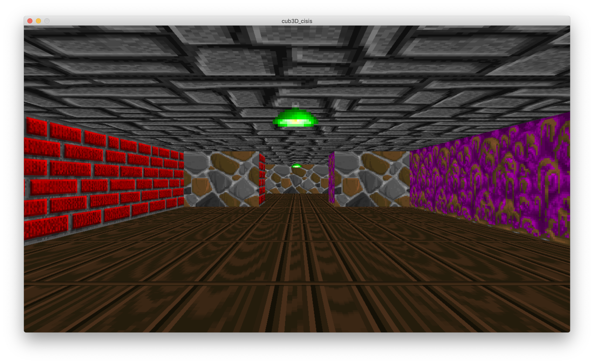

# raycaster_engine (Ecole 42's "cub3D")

The target of this project is to write a raycaster engine (Wolfenstein3D-like) using the MinilibX graphics library.

The program takes a path to .cub config file which specifies following parameters:
* Screen resolution
* Wall textures (each direction has its own texture)
* Sprite texture (only supports one texture for sprite)
* Wall and ceiling textures (supports plain colors in R,G,B format)
* A map with the the following chars:
  - '1' for a wall
  - '0' for empty space
  - '2' for a sprite
  - 'N', 'S', 'W', 'E' for a player looking at the corresponding direcion (may be only one in the map)
  
## How to play:
**Mac OS only**

To build: `make`

To run: `./cub3D path/to/the/map.cub`
(Folder `maps` contains a few example config-files)

To render the screenshot without running add `--save` argument

Controls:
* **WASD** to move
* **Left** and **Right** to turn the camera
* **ESC** to close the window

